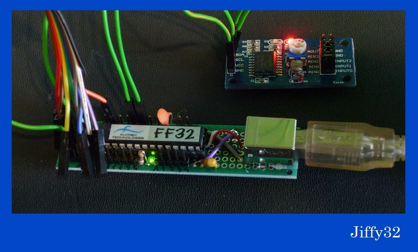

# jiffy32
##Description


A java library intended for interfacing with FlyFish Technologies FF32 General Purpose Input Output USB dongle

http://www.flyfish-tech.com/FF32/index.php

This code is based on "FF32 demo" written in C and published to the Public Domain

## Credits
Engineering team at FlyFish Technologies for FF32 chip

Original author of FF32 C library for codebase

Codeminders for their [javahidapi](https://code.google.com/p/javahidapi/)

## Build
Building process is handled by maven tool, which takes care of dependencies needed by this project
```shell
    mvn clean
    mvn compile
```

## Usage
Example usage can be found in org.warheim.interfacing.jiffy32.JiffyTest class. Protoboard wiring example will follow shortly.

## Current project status
Work in progress

Basic calls are working (dongle metadata, digital, analog and pwm single and mutliple pin i/o requests)

i2c calls are working (tested with PCF8591 chip)

SPI and 1-Wire calls are implemented, but not tested yet

Library supports multiple dongles attached simultaneously

No optimization has been done yet 
